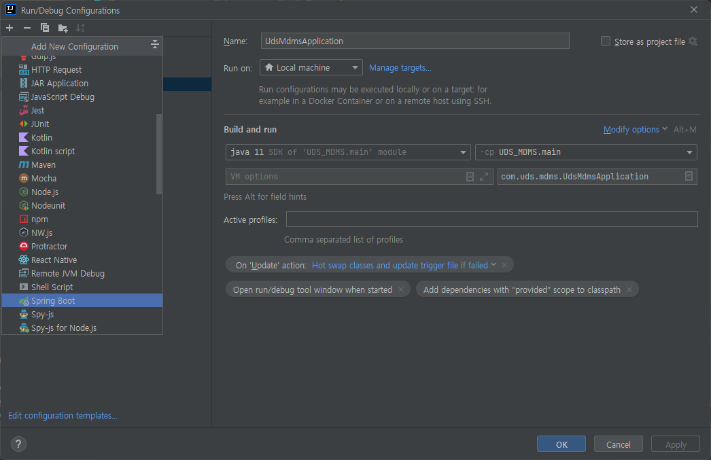

# UDS_LCMS

> UDS Licence Management System
> 
> : UDS 솔루션 및 고객별 라이센스를 관리하는 시스템


## 목차
1. [Project Setting](#project-setting)


## Project Setting
1. Git clone
   ```
   git clone https://github.com/UDS-SPEG/UDS_LCMS.git
   ```


2. Git Submodule update
 
   ```
   cd .\UDS_LCMS
   
   git submodule update --init
   ```


3. Frontend(nuxt) init

   ```
   cd .\uds-lcms-core\src\main\nuxt
   npm install
   npm run generate
   ```

4. Run
   - Backend
     1. Edit Run/Debug Configurations
     
     2. Run(Shift + F10) / Debug(Shift + F9)
     
   - Frontend
     1. `$ cd [UDS_LCMS]\uds-lcms-core\src\main\nuxt`
     2. `$ npm run dev`
